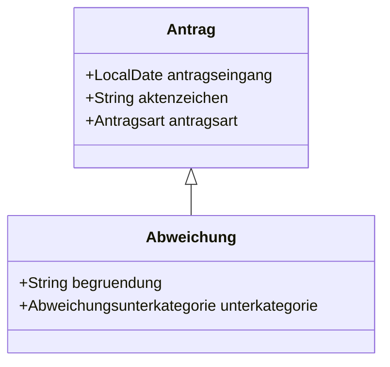

## Jmix Bauamt

Jmix 2.0 example application that shows how to create a domain model with entity inheritance and how to use them in the UI.

### Domain Model


Antrag (german for application / request) is the base model of the inheritance. It uses joined table inheritance, meaning that the base table contains the common attributes of all Antrag entities.

The subclass Abweichung is a special type of Antrag adds two attributes to the base model. The subclass is mapped to a separate table, which contains the additional attributes. By using a different table, it is possible to have required fields on the subclass, which is not possible with single table inheritance.



### UI

For simplicity' sake the UI views for both entities are different view classes. When creating a new Antrag, the user can choose the type of Antrag. Depending on the type, the corresponding view is opened.


### Deploy to Heroku

1. Create a production mode jar 
```shell
./gradlew stage
```

2. Configure Heroku CLI
```shell
heroku plugins:install java 
```

3. deploy jar directly to heroku
```shell
heroku deploy:jar build/libs/bauamt-0.0.1-SNAPSHOT.jar --app jmix-bauamt
```
